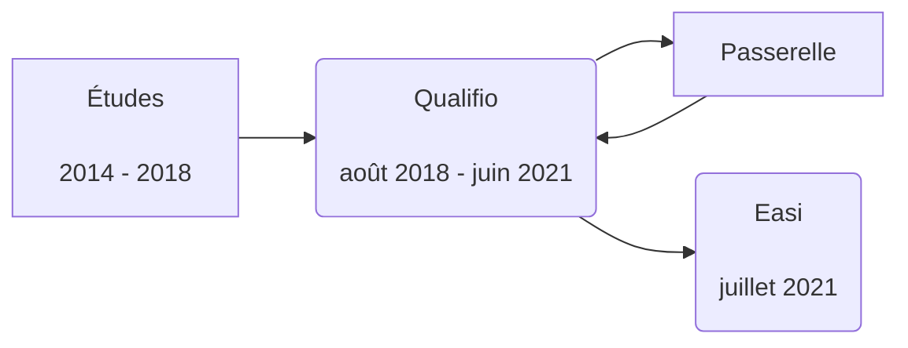

# Devenir Développeur <twemoji-laptop />

### Métiers de l'informatique - 2022

[Guillaume Quittet](https://v01dsocity.com)

---
layout: section
---

# Qui suis-je ? <twemoji-man-shrugging />

---
layout: default
---

# Qui suis-je ? <twemoji-man-shrugging />

<v-click>

```typescript {all|2|3|4|5|all}
export class Me {
  name: string = "Guillaume Quittet";
  age: number = 25;
  job: Job = Job.DEVELOPER;
  since: number = 4 * ONE_YEAR;
}
```

</v-click>

<v-click>

<div class="flex gap-2 w-full mt-10 items-center justify-center">
  
  <a href="https://github.com/gquittet" target="_blank">github.com/gquittet</a>
</div>

</v-click>

<!--
- Etude HEH
- Diplôme 2018
- Travaille depuis 4 ans
-->

---
layout: section
---

# Parcours <twemoji-man-student />

---
layout: default
---

<style>
  .mermaid {
    @apply flex justify-center transform scale-125;
  }
</style>

# Parcours <twemoji-man-student />

<v-click>

<div class="container px-12 mx-auto">



</div>

<div class="flex items-center space-x-80 mt-12">
  
  
</div>
</v-click>


---
layout: section
---

# Travail <twemoji-man-technologist />

---
layout: image-right
image: /dev-env.jpg
---

# Travail <twemoji-man-technologist />

<v-clicks>

- Développement interne
    - Node.js et Python
    - Environnement UNIX (Linux et macOS)
    - Back-End (REST API, Worker, ...)
    - Front-End
    - Déploiement avec Docker
- Analyse
- Estimation
- Gestion d'équipe
- Communication
- Formations

</v-clicks>

---
layout: section
---

# Conseils <twemoji-light-bulb />

---
layout: image-left
image: /tools-env.jpg
---


<div class="text-right">

# Conseils <twemoji-light-bulb />

</div>

<v-clicks>

- Un bon éditeur de texte ou IDE
  - IntelliJ
  - VSCode avec un client SQL
- **Maîtrisez vos outils**
- **Automatisez**
- **Terminal / Shell**
- **Git**
- Soyez proactif
- Formez-vous régulièrement

  <twemoji-warning /> YouTube ne suffit pas

- Apprenez à estimer

</v-clicks>

---
layout: section
---

# Apprentissage <twemoji-books />

---
layout: image-right
image: /learning.jpg
---

# Apprentissage <twemoji-books />


<v-clicks>

- SOLID principles
- Design patterns
- Functional programming
- Async programming
- Testing
- Debugging
- Sécurité
  - Droits
  - Token/Authentification
  - Hacking

</v-clicks>

---
layout: section
---

# Bien-être <twemoji-man-in-lotus-position />

---
layout: image-left
image: /nature-zen.jpg
---

<div class="text-right">

# Bien-être <twemoji-man-in-lotus-position />

</div>

<v-clicks>

- Videz-vous la tête
  - Sport
  - Jeux
  - ...
- Restez dans le plaisir
- Libérez votre cerveau
  - Tâches
  - Agenda
  - Documentation

</v-clicks>

---
layout: end
---

# Merci <twemoji-folded-hands />